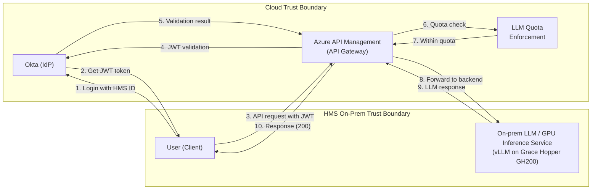

# HMS AI Inference Service

Send prompts to a private, HMS-hosted AI model. You log in with your HMS ID to
get a short-lived access token, then call a secure gateway that checks your
identity and usage quota before forwarding the request to the model.

Under the hood: an on-prem large language model served by **vLLM** on an
**NVIDIA Grace Hopper GH200**, exposed through **Azure API Management**. The
gateway speaks both the **Anthropic Messages API** and the **OpenAI API**, so
Anthropic- and OpenAI-based clients (Claude Code, OpenAI SDKs, LiteLLM, …) work
without changing tooling. *On-prem* means HMS's own hardware, not the cloud.

## At a glance

|              |                                                                                                |
| ------------ | ---------------------------------------------------------------------------------------------- |
| **Base URL** | `https://ai-poc.hms.edu`                                                                       |
| **Model ID** | `google/gemma-4-31B-it`                                                                        |
| **Anthropic**| `POST /v1/messages`                                                                            |
| **OpenAI**   | `POST /v1/chat/completions`, `GET /v1/models`                                                   |
| **Auth**     | `Authorization: Bearer <Okta JWT>` — short-lived, refreshable                                   |
| **Needs**    | HMS VPN, `curl`, `jq`                                                                          |

## Before you start

- **You must be on the HMS VPN.** The endpoint is unreachable otherwise.
- **Your HMS username is not your email.** Find it under
  [login.hms.harvard.edu → Profile](https://login.hms.harvard.edu/account-settings/profile).

## Quickstart

```bash
# 1. Get a token (prompts for HMS username + password)
export HMS_AI_TOKEN="$(./get-okta-token.sh | awk -F'Token: ' '/Token:/{print $2}')"

# 2. Test the endpoint
curl --silent https://ai-poc.hms.edu/v1/messages \
  --header "Authorization: Bearer $HMS_AI_TOKEN" \
  --header "anthropic-version: 2023-06-01" \
  --header "Content-Type: application/json" \
  --data '{"model":"google/gemma-4-31B-it","max_tokens":256,
           "messages":[{"role":"user","content":"Say hello in one sentence."}]}'

# 3. Point a client at it — Claude Code, for example
export ANTHROPIC_BASE_URL=https://ai-poc.hms.edu
export ANTHROPIC_AUTH_TOKEN="$HMS_AI_TOKEN"
export ANTHROPIC_DEFAULT_OPUS_MODEL=google/gemma-4-31B-it
export ANTHROPIC_DEFAULT_SONNET_MODEL=google/gemma-4-31B-it
export ANTHROPIC_DEFAULT_HAIKU_MODEL=google/gemma-4-31B-it
claude
```

Token expired? Re-run step 1 — or set up
[automatic refresh](#step-3--point-claude-code-at-the-endpoint), which is worth
the five minutes if you use this daily.

---

## How it works

You never talk to the model directly. It sits inside the HMS on-prem trust
boundary with no external access, so every request goes through the Azure API
Management (APIM) gateway — request and response both.



Three phases, and the failure of each is the error code you'll see:

| Phase | What happens | Failure |
| --- | --- | --- |
| **Authenticate** | You log in to Okta, which issues a JWT access token | Bad credentials → error from the token endpoint |
| **Authorize** | APIM validates the JWT against Okta and checks your quota | Missing/invalid token → `401`/`403`; over quota → `429` |
| **Inference** | APIM forwards to the on-prem model and returns its reply | — |

---

## Step 1 — Get a token

Run the included helper, [`get-okta-token.sh`](./get-okta-token.sh):

```bash
./get-okta-token.sh
# Enter Username: your-hms-id
# Password: ********
# Token: eyJraWQiOi...
```

It prints a labelled line, so capture the token with `awk`:

```bash
export HMS_AI_TOKEN="$(./get-okta-token.sh | awk -F'Token: ' '/Token:/{print $2}')"
```

Add `-r`/`--refresh` to get a **refresh token** instead — a longer-lived
credential that mints access tokens without your password. See
[Refresh tokens](#refresh-tokens).

<details>
<summary>Calling the Okta token endpoint yourself</summary>

The service uses the OAuth 2.0 Resource Owner Password grant:

```bash
curl --silent --request POST \
  --url "https://login.hms.harvard.edu/oauth2/aus155lzzptyDTgN3698/v1/token" \
  --header "Accept: application/json" \
  --header "Content-Type: application/x-www-form-urlencoded" \
  --data "client_id=0oa139tiylzbW6XnX698" \
  --data "grant_type=password" \
  --data "username=$HMS_USERNAME" \
  --data "password=$HMS_PASSWORD" \
  --data "scope=openid offline_access" \
| jq -r '.access_token'
```

Note that Okta returns HTTP 200 even for bad credentials — check for an
`access_token` in the body rather than trusting the status code.

</details>

> **Credentials.** Access tokens are short-lived by design. Don't hard-code your
> password in scripts or commit tokens to source control; use environment
> variables or a secrets manager.

---

## Step 2 — Make a test call

Both API dialects hit the same vLLM backend through the same Okta and quota
checks — only the request shape differs. Use whichever your tools already speak.

### Anthropic Messages API

```bash
curl --silent https://ai-poc.hms.edu/v1/messages \
  --header "Authorization: Bearer $HMS_AI_TOKEN" \
  --header "anthropic-version: 2023-06-01" \
  --header "Content-Type: application/json" \
  --data '{
    "model": "google/gemma-4-31B-it",
    "max_tokens": 256,
    "messages": [
      { "role": "user", "content": "Say hello in one sentence." }
    ]
  }'
```

A `200` returns the model's reply as JSON. To check auth alone, without waiting
on inference, print just the status code:

```bash
curl --silent -o /dev/null -w "%{http_code}\n" https://ai-poc.hms.edu/v1/messages \
  --header "Authorization: Bearer $HMS_AI_TOKEN" \
  --header "anthropic-version: 2023-06-01" \
  --header "Content-Type: application/json" \
  --data '{"model":"google/gemma-4-31B-it","max_tokens":1,"messages":[{"role":"user","content":"hi"}]}'
```

### OpenAI API

vLLM serves the OpenAI API natively, and the gateway exposes those routes. Use
the same Bearer token — handy for OpenAI SDKs and tools like LiteLLM, Continue,
or Aider:

```bash
curl --silent https://ai-poc.hms.edu/v1/chat/completions \
  --header "Authorization: Bearer $HMS_AI_TOKEN" \
  --header "Content-Type: application/json" \
  --data '{
    "model": "google/gemma-4-31B-it",
    "messages": [
      { "role": "user", "content": "Say hello in one sentence." }
    ]
  }'
```

To list the models the backend advertises:

```bash
curl --silent https://ai-poc.hms.edu/v1/models \
  --header "Authorization: Bearer $HMS_AI_TOKEN" | jq .
```

---

## Step 3 — Point Claude Code at the endpoint

Claude Code works with any Anthropic-compatible gateway: it POSTs to
`ANTHROPIC_BASE_URL` + `/v1/messages` with a bearer token. It requests three
model tiers (Opus / Sonnet / Haiku) depending on the task, but the gateway serves
one model — so point all three tiers at `google/gemma-4-31B-it` and every
request resolves there whichever tier it picks.

Pick one of two setups:

| | Option A — static token | Option B — auto-refreshing (recommended) |
| --- | --- | --- |
| Setup | Export env vars | One-time refresh token + `settings.json` |
| Token expires | You re-export by hand | Handled for you |
| Good for | A single session, first try | Day-to-day use |

### Option A — static token

```bash
export ANTHROPIC_BASE_URL='https://ai-poc.hms.edu'
export ANTHROPIC_AUTH_TOKEN="$HMS_AI_TOKEN"   # the JWT from step 1
export ANTHROPIC_DEFAULT_OPUS_MODEL='google/gemma-4-31B-it'
export ANTHROPIC_DEFAULT_SONNET_MODEL='google/gemma-4-31B-it'
export ANTHROPIC_DEFAULT_HAIKU_MODEL='google/gemma-4-31B-it'
```

Use `ANTHROPIC_AUTH_TOKEN`, **not** `ANTHROPIC_API_KEY`: the former sends
`Authorization: Bearer <token>`, which is what the gateway expects, while the
latter sends `x-api-key`.

### Option B — auto-refreshing token via `apiKeyHelper`

`apiKeyHelper` is a script Claude Code runs to fetch a token on demand and on any
`401`. Its stdout is sent as both `Authorization: Bearer <output>` and
`x-api-key: <output>`; the gateway reads the Bearer header.

This repo ships one: [`hms-ai-token.sh`](./hms-ai-token.sh). It prints only the
token to stdout (everything else goes to stderr) and logs in via a stored refresh
token, falling back to `HMS_USERNAME`/`HMS_PASSWORD` if that token stops working
— which makes the setup self-healing.

**1. Seed the refresh token** into the file the helper manages:

```bash
mkdir -p ~/.claude
umask 077; ./get-okta-token.sh --refresh \
  | awk -F'Refresh: ' '/Refresh:/{print $2}' > ~/.claude/.hms_refresh_token

# Optional password fallback, from your shell profile or a secrets manager
export HMS_USERNAME=... HMS_PASSWORD=...

# Sanity check — run it twice, both must print a token
./hms-ai-token.sh && ./hms-ai-token.sh
```

Running it twice is the real test: it proves token rotation is being persisted.
See [Refresh tokens](#refresh-tokens) for why.

**2. Install the helper** somewhere stable, since `apiKeyHelper` needs an
absolute path:

```bash
cp hms-ai-token.sh ~/.claude/hms-ai-token.sh && chmod 700 ~/.claude/hms-ai-token.sh
```

**3. Configure Claude Code** in `~/.claude/settings.json` (all projects) or a
project's `.claude/settings.json`:

```json
{
  "apiKeyHelper": "/home/you/.claude/hms-ai-token.sh",
  "env": {
    "ANTHROPIC_BASE_URL": "https://ai-poc.hms.edu",
    "ANTHROPIC_DEFAULT_OPUS_MODEL": "google/gemma-4-31B-it",
    "ANTHROPIC_DEFAULT_SONNET_MODEL": "google/gemma-4-31B-it",
    "ANTHROPIC_DEFAULT_HAIKU_MODEL": "google/gemma-4-31B-it",
    "CLAUDE_CODE_API_KEY_HELPER_TTL_MS": "300000",
    "CLAUDE_CODE_DISABLE_NONESSENTIAL_TRAFFIC": "1"
  }
}
```

- Leave `ANTHROPIC_AUTH_TOKEN` unset — the helper's output is the bearer token.
- `CLAUDE_CODE_API_KEY_HELPER_TTL_MS` is how often the helper re-runs (5 minutes
  here). Keep it comfortably under the token's real lifetime; Claude Code also
  re-runs the helper on a `401`.
- `CLAUDE_CODE_DISABLE_NONESSENTIAL_TRAFFIC=1` disables auto-updates, telemetry,
  and model discovery — appropriate for a private gateway.
- Values in a settings `env` block override shell exports of the same variable.

**4. Verify:**

```bash
claude -p "Reply with exactly: ok"
```

`401`/`403` means the token is missing or expired; `429` means you've hit your
quota.

---

## Refresh tokens

The `openid offline_access` scope returns a `refresh_token` next to the access
token. It's longer-lived and mints new access tokens without your password —
this is what `hms-ai-token.sh` uses.

Get one with:

```bash
./get-okta-token.sh --refresh
# Enter Username: your-hms-id
# Password: ********
# Refresh: 0.AR8A...
```

### They rotate — each one is single-use

Every `grant_type=refresh_token` call returns a **new** `refresh_token`, and Okta
retires the one you just spent after a grace period of roughly 30 seconds. You
must save the replacement and send that one next time.

Ignoring the returned `refresh_token` is the most common way to break this setup:
the first refresh succeeds, then every later one fails with
`invalid_grant: The refresh token is invalid or expired.`

This is also why the token **must live in a file, not an environment variable**.
A script can't write to its parent shell's environment, so a token held in
`HMS_REFRESH_TOKEN` gets replayed after it's been retired — the helper works once
or twice, then fails. Accordingly, `hms-ai-token.sh` owns
`~/.claude/.hms_refresh_token` (mode `600`), rewrites it after every login, and
takes a lock so concurrent runs can't invalidate each other's token. Set
`HMS_REFRESH_TOKEN_FILE` to keep it elsewhere. `HMS_REFRESH_TOKEN` still works,
but only to bootstrap the file on a first run.

Treat that file like a password: until it expires or is revoked, it grants access
without your credentials.

<details>
<summary>Doing the refresh by hand</summary>

Prefer the helper — it handles rotation and locking — but the flow is:

```bash
response="$(curl --silent --request POST \
  --url "https://login.hms.harvard.edu/oauth2/aus155lzzptyDTgN3698/v1/token" \
  --header "Accept: application/json" \
  --header "Content-Type: application/x-www-form-urlencoded" \
  --data "client_id=0oa139tiylzbW6XnX698" \
  --data "grant_type=refresh_token" \
  --data-urlencode "refresh_token=$(cat ~/.claude/.hms_refresh_token)" \
  --data "scope=openid offline_access")"

echo "$response" | jq -r '.access_token'                                 # use now
echo "$response" | jq -r '.refresh_token' > ~/.claude/.hms_refresh_token # use next time
```

</details>

---

## Troubleshooting

| Symptom | Likely cause | Fix |
| --- | --- | --- |
| `401` / `403` from the gateway | No token, expired token, or malformed header | Re-acquire the token; confirm the header is `Authorization: Bearer <jwt>` |
| `429` | LLM quota exceeded | Back off and retry; ask the platform team for more quota |
| Token endpoint returns an error | Wrong username/password, or account not enabled for the service | Check credentials (username ≠ email); contact the platform team |
| `invalid_grant: The refresh token is invalid or expired` — works at first, then fails | The rotated refresh token wasn't saved, so a retired one is being replayed. Classically: it's in `HMS_REFRESH_TOKEN` rather than a file | Use `hms-ai-token.sh`, which manages the file itself; re-seed with `get-okta-token.sh --refresh`. See [Refresh tokens](#refresh-tokens) |
| `timed out waiting for another token refresh to finish` | A crashed run left `~/.claude/.hms_refresh_token.lock` behind | Locks older than 2 minutes clear themselves; otherwise `rmdir ~/.claude/.hms_refresh_token.lock` |
| Claude Code ignores your token | `ANTHROPIC_API_KEY` is set (takes the `x-api-key` path), or a settings `env` block overrides your shell var | Use `ANTHROPIC_AUTH_TOKEN` or `apiKeyHelper`; check `~/.claude/settings.json` |
| Model-not-found | Wrong model ID | Use `google/gemma-4-31B-it`; `GET /v1/models` lists what the backend serves |
| Nothing connects at all | Not on the HMS VPN | Connect and retry |
