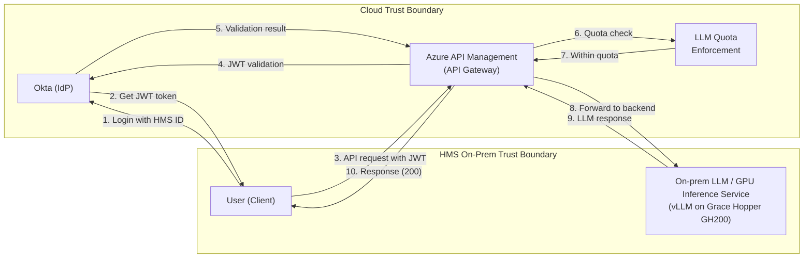

# HMS AI Inference Service

This service lets HMS users send prompts to a private, HMS-hosted AI model. You
log in with your HMS ID to get a temporary access token, then send requests to a
secure gateway that checks your identity and usage limits before passing them to
the model.

**In technical terms:** a GPU inference service that exposes an on-prem large
language model (LLM) to HMS users through a cloud API gateway. The gateway
speaks both the **Anthropic Messages API** and the **OpenAI API**, so you can
call it from Anthropic- or OpenAI-based clients (Claude Code, OpenAI SDKs,
LiteLLM, etc.) without changing tooling. The model is served by **vLLM** on an
**NVIDIA Grace Hopper GH200**. *On-prem* means it runs on HMS's own hardware,
not in the cloud. Access is secured with Okta-issued JWTs (signed, short-lived
access tokens).

## Contents

- [TL;DR quickstart](#tldr-quickstart)
- [How it works](#how-it-works)
- [1. Acquire a token](#1-acquire-a-token)
- [2. Make a test call with curl](#2-make-a-test-call-with-curl)
  - [OpenAI-compatible API](#openai-compatible-api)
- [3. Use the endpoint with Claude Code](#3-use-the-endpoint-with-claude-code)
  - [Option A — quick start](#option-a--quick-start-static-token-via-environment)
  - [Option B — recommended: auto-refreshing token](#option-b--recommended-auto-refreshing-token-via-apikeyhelper)
- [Keeping the token fresh](#keeping-the-token-fresh)
- [Troubleshooting](#troubleshooting)

## TL;DR quickstart

> **Before you start:**
> - **Username ≠ email.** Your HMS username isn't your HMS email — find it under
>   [login.hms.harvard.edu → Profile](https://login.hms.harvard.edu/account-settings/profile).
> - **VPN required.** You must be connected to the HMS VPN to reach the endpoint.

```bash
# 1. Get a token (interactive — prompts for your HMS username + password)
export HMS_AI_TOKEN="$(./get-okta-token.sh | awk -F'Token: ' '/Token:/{print $2}')"

# 2. Test the endpoint
curl --silent https://ai-poc.hms.edu/v1/messages \
  --header "Authorization: Bearer $HMS_AI_TOKEN" \
  --header "anthropic-version: 2023-06-01" \
  --header "Content-Type: application/json" \
  --data '{"model":"google/gemma-4-31B-it","max_tokens":256,
           "messages":[{"role":"user","content":"Say hello in one sentence."}]}'

# 3. Point your application at it, e.g. for Claude Code:
export ANTHROPIC_BASE_URL=https://ai-poc.hms.edu
export ANTHROPIC_DEFAULT_OPUS_MODEL=google/gemma-4-31B-it
export ANTHROPIC_DEFAULT_SONNET_MODEL=google/gemma-4-31B-it
export ANTHROPIC_DEFAULT_HAIKU_MODEL=google/gemma-4-31B-it
export ANTHROPIC_AUTH_TOKEN="$HMS_AI_TOKEN"
claude
```

Token expired? Re-run step 1. For an auto-refreshing setup, see
[Option B](#option-b--recommended-auto-refreshing-token-via-apikeyhelper).

---

## How it works

You never talk to the on-prem model directly — it sits inside the **HMS On-Prem
Trust Boundary** with no external access. Instead, every request flows through
**Azure API Management (APIM)**, a cloud gateway that authenticates and
rate-limits you before forwarding the request to the backend. Both the request
and the response pass through the gateway; a client never reaches the backend
directly.



In short, three phases:

1. **Authenticate (AuthN).** You log in to Okta with your HMS credentials and
   receive a JWT access token.
2. **Authorize (AuthZ).** You call the APIM gateway with the JWT. APIM validates
   the token against Okta and checks that you are within your LLM quota.
   - No or invalid token → `401` / `403`
   - Over quota → `429`
3. **Inference.** On success, APIM forwards your request to the on-prem model and
   returns the response.

---

## 1. Acquire a token

The service uses the OAuth 2.0 **Resource Owner Password** grant against Okta.
A helper script, [`get-okta-token.sh`](./get-okta-token.sh), is included for
interactive use:

```bash
./get-okta-token.sh
# Enter Username: your-hms-id
# Password: ********
# Token: eyJraWQiOi...
```

Or call the token endpoint directly:

```bash
curl --silent --request POST \
  --url "https://login.hms.harvard.edu/oauth2/aus155lzzptyDTgN3698/v1/token" \
  --header "Accept: application/json" \
  --header "Content-Type: application/x-www-form-urlencoded" \
  --data "client_id=0oa139tiylzbW6XnX698" \
  --data "grant_type=password" \
  --data "username=$HMS_USERNAME" \
  --data "password=$HMS_PASSWORD" \
  --data "scope=openid offline_access" \
| jq -r '.access_token'
```

To keep the token handy for the calls below, capture it in an environment
variable:

```bash
export HMS_AI_TOKEN="$(./get-okta-token.sh | awk -F'Token: ' '/Token:/{print $2}')"
# or, from the raw curl above:
# export HMS_AI_TOKEN="$(curl ... | jq -r '.access_token')"
```

**Token lifetime.** Access tokens are short-lived, so you'll need to refresh
them. The `offline_access` scope also returns a `refresh_token` that mints new
access tokens without re-entering your password — see
[Keeping the token fresh](#keeping-the-token-fresh).

**Handle your credentials carefully.** Don't hard-code your password in scripts
or commit tokens to source control. Prefer environment variables or a secrets
manager.

---

## 2. Make a test call with curl

The service speaks two API dialects over the same gateway, so you can use
whichever your tools already support:

- **Anthropic Messages API** (`POST /v1/messages`) — used below and by Claude Code.
- **OpenAI API** (`POST /v1/chat/completions`) — for OpenAI SDKs and tools; see
  [OpenAI-compatible API](#openai-compatible-api).

Both hit the same vLLM backend and the same Okta/quota checks; only the request
shape differs. We'll start with the Anthropic Messages API — send requests to
`POST /v1/messages` with your JWT as a Bearer token:

```bash
curl --silent https://ai-poc.hms.edu/v1/messages \
  --header "Authorization: Bearer $HMS_AI_TOKEN" \
  --header "anthropic-version: 2023-06-01" \
  --header "Content-Type: application/json" \
  --data '{
    "model": "google/gemma-4-31B-it",
    "max_tokens": 256,
    "messages": [
      { "role": "user", "content": "Say hello in one sentence." }
    ]
  }'
```

A successful call (`200`) returns a JSON body with the model's reply. The common
failures — `401`/`403` (bad or expired token) and `429` (over quota) — map to the
three phases above; see [Troubleshooting](#troubleshooting) for the full list.

Quick way to check auth is working without a full inference call:

```bash
curl --silent -o /dev/null -w "%{http_code}\n" https://ai-poc.hms.edu/v1/messages \
  --header "Authorization: Bearer $HMS_AI_TOKEN" \
  --header "anthropic-version: 2023-06-01" \
  --header "Content-Type: application/json" \
  --data '{"model":"google/gemma-4-31B-it","max_tokens":1,"messages":[{"role":"user","content":"hi"}]}'
```

### OpenAI-compatible API

The backend is vLLM, which also serves the **OpenAI API** natively. If the
gateway exposes the OpenAI routes (confirm with the platform team), you can use
`POST /v1/chat/completions` with the same Bearer token — handy for OpenAI SDKs
and tools like LiteLLM, Continue, or Aider:

```bash
curl --silent https://ai-poc.hms.edu/v1/chat/completions \
  --header "Authorization: Bearer $HMS_AI_TOKEN" \
  --header "Content-Type: application/json" \
  --data '{
    "model": "google/gemma-4-31B-it",
    "messages": [
      { "role": "user", "content": "Say hello in one sentence." }
    ]
  }'
```

List the models the backend advertises:

```bash
curl --silent https://ai-poc.hms.edu/v1/models \
  --header "Authorization: Bearer $HMS_AI_TOKEN" | jq .
```

Rule of thumb: use the **Anthropic Messages API** for Claude Code, and the
**OpenAI API** for OpenAI-based clients.

---

## 3. Use the endpoint with Claude Code

Claude Code can point at any Anthropic-compatible gateway: it sends requests to
`ANTHROPIC_BASE_URL` + `/v1/messages` with your JWT as the bearer token. It also
asks for three model "tiers" (Opus / Sonnet / Haiku) depending on the task, but
the gateway serves a single vLLM model — so you point all three tiers
(`ANTHROPIC_DEFAULT_OPUS_MODEL`, `ANTHROPIC_DEFAULT_SONNET_MODEL`,
`ANTHROPIC_DEFAULT_HAIKU_MODEL`) at `google/gemma-4-31B-it`, and every request
resolves to it regardless of which tier Claude Code picks.

### Option A — quick start (static token via environment)

Good for a single session. The token expires, so you'll re-run this when it does.
Export these in your shell before launching `claude`:

```bash
export ANTHROPIC_BASE_URL='https://ai-poc.hms.edu'
export ANTHROPIC_DEFAULT_OPUS_MODEL='google/gemma-4-31B-it'
export ANTHROPIC_DEFAULT_SONNET_MODEL='google/gemma-4-31B-it'
export ANTHROPIC_DEFAULT_HAIKU_MODEL='google/gemma-4-31B-it'
export ANTHROPIC_AUTH_TOKEN='[YOUR_TOKEN_HERE]'
```

Set `ANTHROPIC_AUTH_TOKEN` to the JWT from step 1 (e.g. `$HMS_AI_TOKEN`). It is
sent as `Authorization: Bearer <token>`, the header the gateway expects. Do
**not** use `ANTHROPIC_API_KEY` here — that sends `x-api-key` instead.

### Option B — recommended: auto-refreshing token via `apiKeyHelper`

Because the JWT is short-lived, the robust setup is an `apiKeyHelper` script that
Claude Code runs to fetch a fresh token on demand (and on any `401`). Whatever the
script prints to stdout is sent as both `Authorization: Bearer <output>` and
`x-api-key: <output>`; the gateway reads the Bearer header.

This repo ships a ready-made, non-interactive helper: [`hms-ai-token.sh`](./hms-ai-token.sh).
It prints only the access token to stdout and reads credentials from the
environment. It supports two modes:

- **Refresh token (recommended, password-free):** set `HMS_REFRESH_TOKEN`
  (get it with `./get-okta-token.sh --refresh` — see
  [Keeping the token fresh](#keeping-the-token-fresh)).
- **Password grant (fallback):** set `HMS_USERNAME` and `HMS_PASSWORD`.

```bash
# Provide credentials via your shell profile or a secrets manager, e.g.:
export HMS_REFRESH_TOKEN="..."          # or: export HMS_USERNAME=... HMS_PASSWORD=...

# Sanity-check it prints a token:
./hms-ai-token.sh
```

Point `apiKeyHelper` at it (use an absolute path — copy it somewhere stable such
as `~/.claude/hms-ai-token.sh`, or reference it in place):

```bash
cp hms-ai-token.sh ~/.claude/hms-ai-token.sh && chmod 700 ~/.claude/hms-ai-token.sh
```

Then configure Claude Code in `~/.claude/settings.json` (user scope) or a
project's `.claude/settings.json`:

```json
{
  "apiKeyHelper": "/home/you/.claude/hms-ai-token.sh",
  "env": {
    "ANTHROPIC_BASE_URL": "https://ai-poc.hms.edu",
    "ANTHROPIC_DEFAULT_OPUS_MODEL": "google/gemma-4-31B-it",
    "ANTHROPIC_DEFAULT_SONNET_MODEL": "google/gemma-4-31B-it",
    "ANTHROPIC_DEFAULT_HAIKU_MODEL": "google/gemma-4-31B-it",
    "CLAUDE_CODE_API_KEY_HELPER_TTL_MS": "300000",
    "CLAUDE_CODE_DISABLE_NONESSENTIAL_TRAFFIC": "1"
  }
}
```

> With `apiKeyHelper`, leave `ANTHROPIC_AUTH_TOKEN` unset — the helper output is
> used as the bearer token instead.

- `CLAUDE_CODE_API_KEY_HELPER_TTL_MS` controls how often the helper is re-run
  (here, every 5 minutes). Claude Code also re-runs it automatically on a `401`.
  Set this comfortably below the token's actual lifetime.
- `CLAUDE_CODE_DISABLE_NONESSENTIAL_TRAFFIC=1` turns off auto-updates, telemetry,
  and model discovery — appropriate when pointing at a private gateway.
- Settings-file `env` values override shell exports of the same variable.

### Verify it works

```bash
claude -p "Reply with exactly: ok"
```

If you get `401`/`403`, your token is missing or expired (re-run the helper /
re-acquire the token). If you get `429`, you've hit your LLM quota.

---

## Keeping the token fresh

The `openid offline_access` scope returns a `refresh_token` alongside the access
token — a long-lived credential that mints new access tokens without your
password. It's what the Option B helper uses.

**Get your refresh token.** Run `get-okta-token.sh` with `-r`/`--refresh`; it
prints the refresh token on a second `Refresh:` line:

```bash
./get-okta-token.sh --refresh
# Enter Username: your-hms-id
# Password: ********
# Token:   eyJraWQiOi...
# Refresh: 0.AR8A...

# Capture just the refresh token into an env var:
export HMS_REFRESH_TOKEN="$(./get-okta-token.sh --refresh | awk -F'Refresh: ' '/Refresh:/{print $2}')"
```

**Use it** to obtain new access tokens without re-entering your password:

```bash
curl --silent --request POST \
  --url "https://login.hms.harvard.edu/oauth2/aus155lzzptyDTgN3698/v1/token" \
  --header "Accept: application/json" \
  --header "Content-Type: application/x-www-form-urlencoded" \
  --data "client_id=0oa139tiylzbW6XnX698" \
  --data "grant_type=refresh_token" \
  --data "refresh_token=$HMS_REFRESH_TOKEN" \
  --data "scope=openid offline_access" \
| jq -r '.access_token'
```

Store the refresh token securely (secrets manager or a `chmod 600` file), and
have your `apiKeyHelper` use this flow so Claude Code never needs your password.

---

## Troubleshooting

| Symptom | Likely cause | Fix |
| --- | --- | --- |
| `401` / `403` from the gateway | No token, expired token, or malformed `Authorization` header | Re-acquire the token; confirm the header is `Authorization: Bearer <jwt>` |
| `429` | LLM quota exceeded | Back off and retry; request more quota from the platform team |
| Token endpoint returns an error | Wrong username/password, or the account isn't enabled for the service | Verify HMS credentials; contact the platform team |
| Claude Code ignores your token | `ANTHROPIC_API_KEY` set (takes the `x-api-key` path) or a settings `env` block overriding your shell var | Use `ANTHROPIC_AUTH_TOKEN` / `apiKeyHelper`; check `~/.claude/settings.json` |
| Model-not-found error | Wrong model ID | Use `google/gemma-4-31B-it` (or the current ID from the platform team) |
